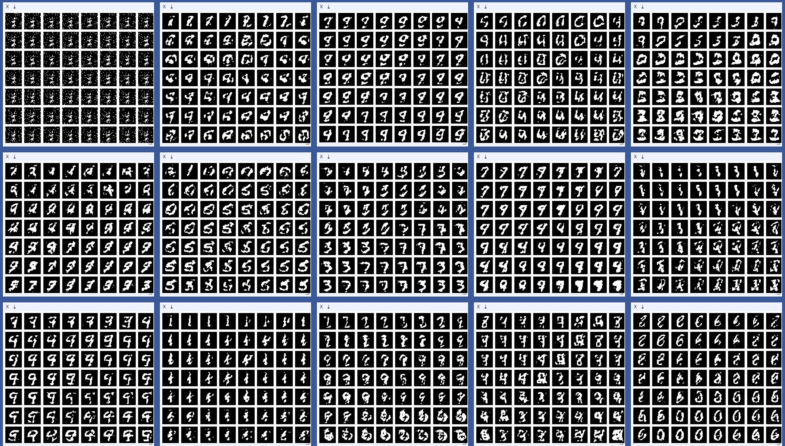

A [pytorch](http://pytorch.org/) implementation of the Helmholtz machine trained with the wake sleep algorithm.

The wake sleep algorithm is described here:

Link: http://www.cs.toronto.edu/~fritz/absps/ws.pdf

Bibtex:

```
@article{hinton1995wake,
  title={The" wake-sleep" algorithm for unsupervised neural networks},
  author={Hinton, Geoffrey E and Dayan, Peter and Frey, Brendan J and Neal, Radford M},
  journal={Science},
  volume={268},
  number={5214},
  pages={1158},
  year={1995},
  publisher={The American Association for the Advancement of Science}
}
```

Generated binarized MNIST examples (work in progress):



Loss plotted for each layer (including the final layer's "generative bias"):


TODO:

- [x] Forward pass of wake phase.
- [x] Forward pass of sleep phase.
- [x] Loss / Optimization of wake phase.
- [x] Loss / Optimization of sleep phase.
- [x] Include real data (MNIST?).
- [ ] Include fashion data.
- [x] Visualize generated digits.
- [x] Explore latent space. (albeit very hacky)
- [x] Plot loss.
- [ ] Incorporate KL Divergence.
- [ ] Incorporate distributions.
- [ ] GPU support.
